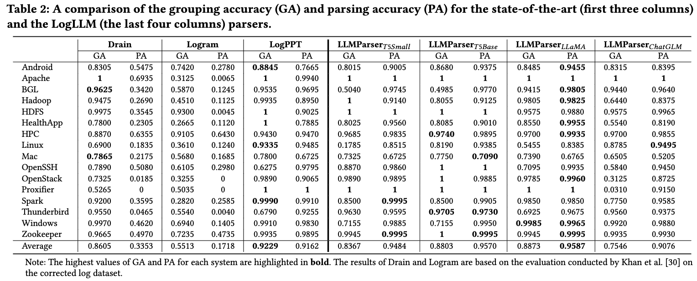
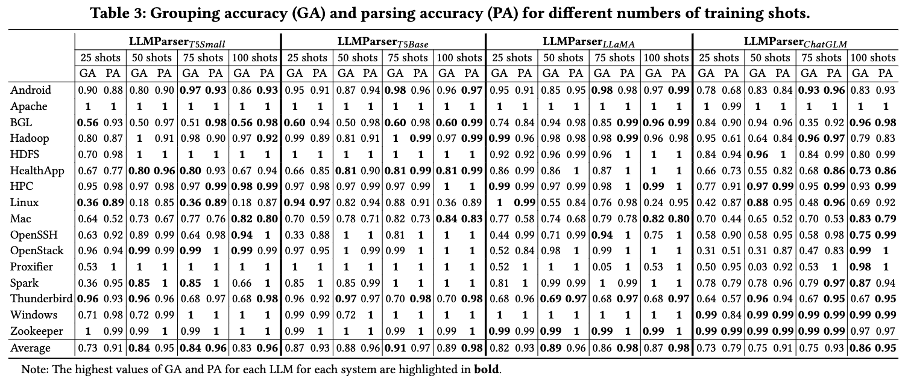
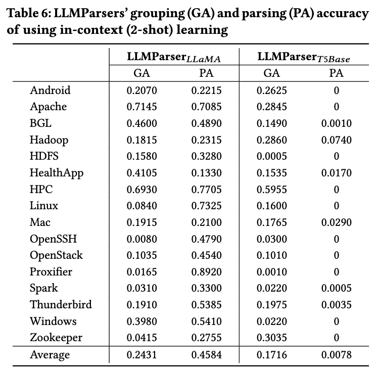
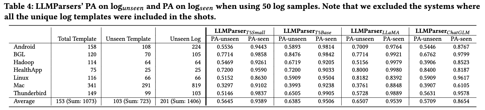
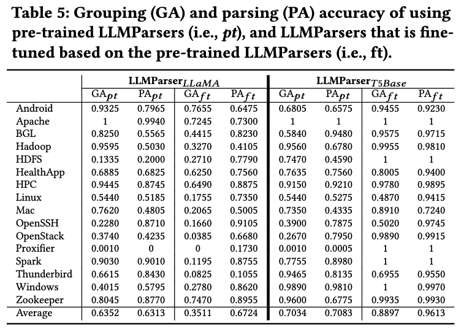

# LLMParser: An Exploratory Study on Using Large Language Models for Log Parsing

## Abstract
Logs are important in modern software development with runtime information. Log parsing is the first step in many log-based analyses, that involve extracting structured information from unstructured log data. Traditional log parsers face challenges in accurately parsing logs due to the diversity of log formats, which directly impacts the performance of downstream log-analysis tasks. In this paper, we explore the potential of using Large Language Models (LLMs) for log parsing and propose LLMParser, an LLM-based log parser based on generative LLMs and few-shot tuning. We leverage four LLMs, Flan-T5-small, Flan-T5-base, LLaMA-7B, and ChatGLM-6B in LLMParsers. Our evaluation of 16 open-source systems shows that LLMParser achieves statistically significantly higher parsing accuracy than state-of-the-art parsers (a 96% average parsing accuracy). We further conduct a comprehensive empirical analysis on the effect of training size, model size, and pre-training LLM on log parsing accuracy. We find that smaller LLMs may be more effective than more complex LLMs, where Flan-T5-base achieves comparable results as LLaMA-7B with a shorter inference time. We also find that using LLMs pre-trained using logs from other systems does not always improve parsing accuracy. Using pre-trained Flan-T5-base shows an improvement in accuracy, but a decrease in pre-trained LLaMA (decrease by almost 55% in group accuracy). In short, our study provides empirical evidence for using LLMs for log parsing and highlights the limitations and future research direction of LLM-based log parsers.

## Structure
We present LLMparser repository structure below.

```
.
├── LLMs
│   ├── chatglm.sh
│   ├── flan-t5-base.sh
│   ├── flan-t5-small.sh
│   └── llama.sh
├── README.md
├── chatglm
│   ├── eval.py
│   ├── modeling_chatglm.py
│   ├── run_copy.sh
│   └── train.py
├── data_sampling.py
├── docs
├── env_init.sh
├── evaluate
│   └── evaluator.py
├── fine_tuned_model
├── flan-t5
│   └── train.py
├── llama
│   ├── 1.py
│   ├── Dockerfile
│   ├── cross_eval.py
│   ├── docker-compose.yml
│   ├── eval.py
│   ├── export.sh
│   ├── export_hf_checkpoint.py
│   ├── finetune.py
│   ├── pyproject.toml
│   ├── run.sh
│   └── utils
│       ├── README.md
│       ├── __init__.py
│       ├── __pycache__
│       │   ├── __init__.cpython-39.pyc
│       │   └── prompter.cpython-39.pyc
│       ├── callbacks.py
│       └── prompter.py
├── logs
│   └── ...
├── output
└── requirements.txt
```


## Environment 
### Requirement
```shell
sh env_init.sh
```

### Large Language Models

To download the Large Language Models:
```shell
cd LLMs
sh flan-t5-base.sh
```


## Data sampling

Sample 50 logs from Mac dataset
```shell
python train.py --project "Mac" \
                --shot 50
```


## Fine-tune and Inference

Flan-T5-base or Flan-T5-small (fine-tuned with 50 shot)
```shell
cd flan-t5
python train.py --model "flan-t5-base"\
                --num_epochs 30 \
                --learning_rate 5e-4 \
                --train_percentage "cross" \
                --validation "validation" \
                --systems "Mac,Android,Thunderbird,HealthApp,OpenStack,OpenSSH,Proxifier,HPC,Zookeeper,Hadoop,Linux,HDFS,BGL,Windows,Apache,Spark"
```

LLaMA (fine-tuned with 50 shot)
```shell
cd llama
sh run.sh 0.025
```

ChatGLM (fine-tuned with 50 shot)
```shell
cd chatglm
sh run.sh 0.025
```

## Evaluation

Evaluate LLM parsing result on certain training dataset size (Flan-T5-base result on 50 shots)
```shell
cd evaluate
python evaluator.py --model "flan-t5-base" \
    --train_percentage "0.025" \
    --systems "Mac,Android,Thunderbird,HealthApp,OpenStack,OpenSSH,Proxifier,HPC,Zookeeper,Hadoop,Linux,HDFS,BGL,Windows,Apache,Spark" 
```

## Evaluation Results
### RQ1: What is the accuracy of LLM?
<p align="center"></p>

### RQ2: How does the accuracy of log parsing vary under different shot sizes?
<p align="center"></p>
<p align="center"></p>

### RQ3: How is the generalizability of LLMParsers on unseen log templates?
<p align="center"></p>

### RQ4: Can pre-trained LLMParsers help improve parsing accuracy?
<p align="center"></p>
